# RoadAssist Database Schema

## Entity Relationship Diagram

```mermaid
erDiagram
    %% User Management
    User ||--o| CustomerProfile : has
    User ||--o| ProviderProfile : has
    User ||--o{ OTPVerification : generates
    User ||--o{ Vehicle : owns
    
    %% Customer Relations
    CustomerProfile ||--o{ Booking : creates
    
    %% Provider Relations
    ProviderProfile ||--o{ Service : offers
    ProviderProfile ||--o{ Booking : accepts
    ProviderProfile ||--o{ TowTruck : operates
    ProviderProfile ||--o{ Certification : has
    ProviderProfile ||--o| ProviderProfile : mentors
    
    %% Vehicle Relations
    Vehicle }o--|| VehicleModel : is_a
    VehicleModel }o--|| VehicleMake : belongs_to
    VehicleModel }o--|| VehicleType : categorized_as
    
    %% Service Relations
    Service }o--|| ServiceCategory : belongs_to
    Service }o--o{ VehicleType : supports
    ServiceCategory ||--o{ ServiceCategory : has_subcategories
    
    %% Booking Relations
    Booking }o--|| Service : books
    Booking }o--|| Vehicle : for
    
    %% Spare Parts Relations
    SparePart }o--|| ProviderProfile : sold_by
    SparePart }o--o{ VehicleModel : compatible_with
    SparePart ||--o{ PartImage : has
    
    %% Review Relations
    Review }o--|| User : written_by
    Review }o--|| ProviderProfile : for
    Review }o--|| Booking : about
    
    %% Payment Relations
    Payment }o--|| Booking : for
    Payment }o--|| User : made_by

    %% User Entity
    User {
        uuid id PK
        string phone UK
        string email
        string role
        boolean is_verified
        boolean is_active
        boolean is_staff
        string preferred_language
        datetime created_at
        datetime updated_at
    }

    %% Customer Profile
    CustomerProfile {
        int id PK
        uuid user_id FK
        json emergency_contact
        json saved_locations
        string default_payment_method
        datetime created_at
        datetime updated_at
    }

    %% Provider Profile
    ProviderProfile {
        int id PK
        uuid user_id FK
        text bio
        int years_experience
        uuid mentor_id FK
        boolean is_mobile
        decimal coverage_radius_km
        decimal latitude
        decimal longitude
        string availability_status
        decimal rating
        int total_jobs
        datetime created_at
        datetime updated_at
    }

    %% OTP Verification
    OTPVerification {
        int id PK
        uuid user_id FK
        string otp_code
        string purpose
        boolean is_used
        datetime expires_at
        datetime created_at
    }

    %% Certification
    Certification {
        uuid id PK
        string name
        string issuing_authority
        text description
        datetime created_at
    }

    %% Vehicle Type
    VehicleType {
        int id PK
        string name UK
        string slug UK
        string icon
        datetime created_at
    }

    %% Vehicle Make
    VehicleMake {
        int id PK
        string name UK
        string slug UK
        string logo
        datetime created_at
    }

    %% Vehicle Model
    VehicleModel {
        int id PK
        int make_id FK
        string name
        string slug
        int vehicle_type_id FK
        int year_start
        int year_end
        datetime created_at
    }

    %% Vehicle
    Vehicle {
        uuid id PK
        uuid owner_id FK
        int model_id FK
        int year
        string color
        string plate_number
        string vin
        boolean is_default
        datetime created_at
        datetime updated_at
    }

    %% Service Category
    ServiceCategory {
        uuid id PK
        string name
        string slug UK
        string icon
        uuid parent_id FK
        datetime created_at
    }

    %% Service
    Service {
        uuid id PK
        int provider_id FK
        uuid category_id FK
        string title
        text description
        decimal base_price
        decimal max_price
        boolean is_home_deliverable
        int avg_duration_minutes
        decimal rating
        int total_bookings
        boolean is_active
        datetime created_at
        datetime updated_at
    }

    %% Booking
    Booking {
        uuid id PK
        int customer_id FK
        int provider_id FK
        uuid service_id FK
        uuid vehicle_id FK
        string status
        string payment_status
        decimal pickup_latitude
        decimal pickup_longitude
        text pickup_address
        decimal destination_latitude
        decimal destination_longitude
        text destination_address
        decimal agreed_price
        decimal platform_fee
        decimal total_amount
        datetime scheduled_at
        datetime accepted_at
        datetime started_at
        datetime completed_at
        datetime cancelled_at
        string otp_start
        string otp_complete
        text notes
        text cancellation_reason
        datetime created_at
        datetime updated_at
    }

    %% Tow Truck
    TowTruck {
        uuid id PK
        int provider_id FK
        string plate_number UK
        decimal capacity_tons
        decimal latitude
        decimal longitude
        string status
        int eta_minutes
        datetime created_at
        datetime updated_at
    }

    %% Spare Part
    SparePart {
        uuid id PK
        int vendor_id FK
        string name
        string sku
        string brand
        uuid category_id FK
        int stock_quantity
        decimal price
        string condition
        datetime last_stock_update
        datetime created_at
        datetime updated_at
    }

    %% Part Image
    PartImage {
        uuid id PK
        uuid part_id FK
        string image_url
        boolean is_primary
        datetime created_at
    }

    %% Review
    Review {
        uuid id PK
        uuid user_id FK
        int provider_id FK
        uuid booking_id FK
        int rating
        text comment
        text provider_response
        datetime response_at
        boolean is_verified
        datetime created_at
        datetime updated_at
    }

    %% Payment
    Payment {
        uuid id PK
        uuid booking_id FK
        uuid user_id FK
        decimal amount
        string currency
        string payment_method
        string stripe_payment_intent_id
        string status
        json metadata
        datetime paid_at
        datetime created_at
        datetime updated_at
    }
```



## Table Descriptions

### Core Tables

#### User
- **Purpose**: Central authentication and user management
- **Key Fields**: phone (unique identifier), role (CUSTOMER/PROVIDER/VENDOR/ADMIN)
- **Indexes**: phone, role
- **Notes**: Uses phone-based authentication for Indian market

#### CustomerProfile
- **Purpose**: Extended profile for customers
- **Key Fields**: emergency_contact (JSON), saved_locations (JSON)
- **Relationship**: One-to-One with User

#### ProviderProfile
- **Purpose**: Extended profile for service providers
- **Key Fields**: rating, availability_status, location coordinates
- **Special**: Self-referencing mentor relationship for protégé system
- **Indexes**: availability_status, rating

### Vehicle Management

#### VehicleType
- **Purpose**: Categories like Car, Bike, Truck
- **Examples**: Sedan, SUV, Motorcycle, Commercial Vehicle

#### VehicleMake
- **Purpose**: Manufacturers
- **Examples**: Maruti Suzuki, Tata, Honda, Hyundai

#### VehicleModel
- **Purpose**: Specific models with year ranges
- **Examples**: Swift (2018-2023), City (2020-2024)

#### Vehicle
- **Purpose**: User's registered vehicles
- **Key Fields**: plate_number, VIN, is_default
- **Relationship**: Belongs to User, references VehicleModel

### Service Management

#### ServiceCategory
- **Purpose**: Hierarchical service categorization
- **Structure**: Tree structure with parent-child relationships
- **Examples**: 
  - Repair → Engine Repair, Brake Service
  - Maintenance → Oil Change, Tire Rotation

#### Service
- **Purpose**: Services offered by providers
- **Key Fields**: base_price, max_price, rating, is_home_deliverable
- **Indexes**: provider, category, rating

### Booking System

#### Booking
- **Purpose**: Core transaction entity
- **Status Flow**: PENDING → ACCEPTED → EN_ROUTE → IN_PROGRESS → COMPLETED
- **Key Fields**: 
  - Location: pickup/destination coordinates
  - Pricing: agreed_price, platform_fee, total_amount
  - Security: otp_start, otp_complete
  - Timeline: scheduled_at, accepted_at, started_at, completed_at
- **Indexes**: customer+status, provider+status, created_at

### Additional Entities

#### TowTruck
- **Purpose**: Track tow truck fleet
- **Key Fields**: capacity_tons, real-time location, status
- **Status**: AVAILABLE, EN_ROUTE, BUSY, OFFLINE

#### SparePart
- **Purpose**: Marketplace inventory
- **Key Fields**: stock_quantity, price, condition (NEW/REFURBISHED/OEM)
- **Real-time**: last_stock_update for inventory tracking

#### Review
- **Purpose**: Rating and feedback system
- **Key Fields**: rating (1-5), comment, provider_response
- **Verification**: is_verified flag for moderation

#### Payment
- **Purpose**: Payment transaction records
- **Integration**: Stripe payment intent tracking
- **Key Fields**: amount, status, payment_method

## Indexes

### Primary Indexes
- All tables have primary key indexes (id)
- UUID fields use uuid_generate_v4()

### Performance Indexes
```sql
-- User lookups
CREATE INDEX idx_users_phone ON users(phone);
CREATE INDEX idx_users_role ON users(role);

-- Provider availability
CREATE INDEX idx_provider_status ON provider_profiles(availability_status);
CREATE INDEX idx_provider_rating ON provider_profiles(rating);

-- Booking queries
CREATE INDEX idx_booking_customer_status ON bookings(customer_id, status);
CREATE INDEX idx_booking_provider_status ON bookings(provider_id, status);
CREATE INDEX idx_booking_created ON bookings(created_at);

-- Service discovery
CREATE INDEX idx_service_provider ON services(provider_id, is_active);
CREATE INDEX idx_service_category ON services(category_id);
CREATE INDEX idx_service_rating ON services(rating);

-- Vehicle lookups
CREATE INDEX idx_vehicle_owner_default ON vehicles(owner_id, is_default);
```

## Constraints

### Unique Constraints
- users.phone
- vehicle_makes.name, vehicle_makes.slug
- vehicle_types.name, vehicle_types.slug
- service_categories.slug
- tow_trucks.plate_number

### Foreign Key Constraints
- All FK relationships enforce referential integrity
- ON DELETE CASCADE for dependent records
- ON DELETE SET NULL for optional relationships (e.g., mentor)

## Data Types

### Monetary Values
- All prices stored as `DECIMAL(10, 2)`
- Currency: INR (Indian Rupees)
- Stored in paise (smallest unit) for precision

### Coordinates
- Latitude: `DECIMAL(9, 6)` (-90 to 90)
- Longitude: `DECIMAL(9, 6)` (-180 to 180)
- Future: Can migrate to PostGIS PointField for spatial queries

### JSON Fields
- emergency_contact: `{"name": "...", "phone": "...", "relation": "..."}`
- saved_locations: `{"home": {...}, "work": {...}}`
- payment metadata: Transaction details and receipts

## Audit Trail

All tables include:
- `created_at`: Timestamp of record creation
- `updated_at`: Timestamp of last modification (auto-updated)

For critical tables, consider adding:
- `created_by`: User who created the record
- `updated_by`: User who last modified
- `deleted_at`: Soft delete timestamp

## Future Enhancements

### PostGIS Integration
```sql
-- Migrate to spatial types
ALTER TABLE provider_profiles 
  ADD COLUMN location GEOGRAPHY(POINT, 4326);

-- Spatial index
CREATE INDEX idx_provider_location 
  ON provider_profiles USING GIST(location);

-- Nearby providers query
SELECT * FROM provider_profiles
WHERE ST_DWithin(
  location,
  ST_MakePoint(longitude, latitude)::geography,
  10000  -- 10km radius
);
```

### Partitioning
```sql
-- Partition bookings by date for performance
CREATE TABLE bookings_2024_01 PARTITION OF bookings
  FOR VALUES FROM ('2024-01-01') TO ('2024-02-01');
```

### Full-Text Search
```sql
-- Add search vectors
ALTER TABLE services 
  ADD COLUMN search_vector tsvector;

CREATE INDEX idx_services_search 
  ON services USING GIN(search_vector);
```

## Backup Strategy

- **Daily**: Full database backup
- **Hourly**: Incremental backups
- **Real-time**: Write-Ahead Logging (WAL) archiving
- **Retention**: 30 days for daily, 7 days for hourly

## Scaling Considerations

1. **Read Replicas**: For analytics and reporting
2. **Connection Pooling**: PgBouncer for connection management
3. **Caching**: Redis for frequently accessed data
4. **Sharding**: By region for geographic distribution
5. **Archiving**: Move old bookings to archive tables

---

**Last Updated**: 2024
**Database Version**: PostgreSQL 16+
**Schema Version**: 1.0.0
